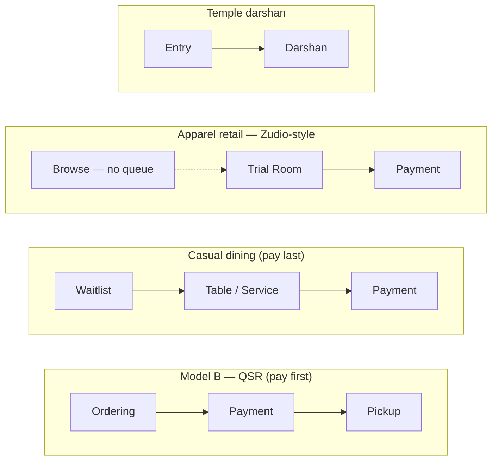

# Queue Flow Architecture — One Engine, Every Business's Queue Shape

**Purpose:** answer "how do we handle the fact that a restaurant's queue, a store's queue, a hospital's queue, and a temple's queue are all genuinely different shapes — without building a different product for each." This is the design this project will build toward next. See `plan.md` (POS integration) and `requirements-summary.md` (source doc) for related context; this document supersedes the "Phase 0 — Visit backbone" framing in `plan.md` with a fuller design, since the `Visit` entity turns out to be needed for this, not only for POS.

---

## 1. The problem, restated

A restaurant's queue isn't one shape. Depending on the format, a customer might wait *before* ordering, *before* paying, *after* paying, for a table, or for pickup — and different restaurant types combine these differently (see the taxonomy that kicked off this design: QSR, Udupi/token-style, table-service, cloud kitchen, food court). The same is true of retail — a simple store's "queue" is just the billing counter, but an apparel store also queues people for trial rooms, a big-box store has independent queues per department, and a jewellery store queues people for a sales consultation before they ever see a till. Hospitals and temples have their own shapes again.

The wrong answer is treating each of these as a different product, or hardcoding a fixed flow per industry. The right answer — and the one this document works out — is recognizing that **every one of these is the same primitive, repeated a different number of times in a different order.**

## 2. The core idea: stages, not industries

Stop asking "what industry is this business in." Ask instead: **"how many places does a customer wait, and in what order?"**

- A **stage** is one place a customer waits or is processed — what today's codebase calls a `Queue`.
- A **flow** is the ordered sequence of stages a branch's customers move through.
- Every business difference — restaurant sub-type, retail format, hospital department chain, temple darshan — is just a different flow: a different number of stages, different types, different order, different payment placement.

One engine walks every flow the same way: a customer enters stage 1, and when stage 1 is marked complete, they either exit (if it was the last stage) or advance into stage 2 automatically. Nothing in that engine needs to know *why* a stage is called "Payment" versus "Pickup" versus "Department" — it only needs to know the order.

## 3. The stage taxonomy

A small, fixed set of stage *types* covers every case seen so far — new business shapes get built from these, not from new stage types:

| Stage type | What happens here | Visible queue (position/ETA)? | Seen in |
|---|---|---|---|
| **Entry / Wait** | Arrival, general waitlist before anything else is decided | Yes | Every vertical — the front door |
| **Ordering** | Choosing what you want (menu, service list) | Yes | QSR, counter-service restaurants |
| **Consultation / Sales** | A staff member helps you decide (a stylist, a jeweller, a doctor) | Yes | Salon, jewellery/furniture retail, hospital OPD |
| **Trial / Fitting** | Trying something before deciding to buy | Yes | Apparel retail (trial rooms) |
| **Payment** | Money changes hands | No — a checkout step, not a line | Wherever billing happens |
| **Preparation / Pickup** | Something is being made or fetched; customer waits to collect | Yes | Kitchen-to-counter, cloud kitchen, pharmacy |
| **Service / Table** | The actual service is delivered here | Sometimes (table wait is a queue; being served isn't) | Table-service dining, department counters, darshan |
| **Department** | A generic named stage for multi-stage institutional flows | Yes | Hospital (Registration → Department → Diagnostics → Billing), big-box retail (Electronics, Customer Service) |
| **Custom** | Anything not covered above; the owner names it | Configurable | Escape hatch — never a reason to add a new hardcoded type |

Everything downstream — terminology, icons, whether a wait time is shown — is data hanging off which type a given stage is, exactly the way `vertical.terminology` already drives wording today. No component ever branches on "is this a restaurant."

## 4. Worked examples

### Restaurants (the taxonomy that started this)

| Model | Flow (stage sequence) |
|---|---|
| A — Udupi/token style | `[Ordering+Payment combined]` → `[Pickup]` |
| B — QSR | `[Ordering]` → `[Payment]` → `[Pickup]` |
| C — Counter service | `[Ordering]` → `[Payment]` → `[Preparation]` → `[Pickup]` |
| D — Casual/family dining | `[Waitlist]` → `[Table/Service]` → `[Payment]` |
| E — Thali/buffet/mess | `[Entry]` → `[Service]` → `[Payment]` |
| F — Cloud kitchen | *(no physical queue)* `[Payment]` → `[Preparation]` → `[Pickup]` |
| G — Food court | N parallel `[Ordering+Payment]` stages (one per stall) → shared `[Pickup]` |

### Retail / stores — the new taxonomy this document adds

| Store format | Flow (stage sequence) | Real example |
|---|---|---|
| Simple billing store | `[Payment]` (the till line *is* the whole queue) | A kirana / small general store |
| Apparel with trial rooms | `[Trial/Fitting]` → `[Payment]` | **Zudio** — this is your own example: browse freely (no queue), wait for a changing room, then bill |
| Big-box / department store | N parallel `[Department]` stages (Electronics, Customer Service, ...) → `[Payment]` | Supermarket with independent section counters |
| Consultation-led retail | `[Consultation/Sales]` (with a specific salesperson) → `[Payment]` | Jewellery store, furniture showroom |
| Click-and-collect | *(payment already done online)* `[Pickup]` only | Order-ahead, in-store pickup |

### Institutional — for completeness

| Vertical | Flow |
|---|---|
| Hospital OPD (current, simple) | `[Department]` only |
| Hospital (full, multi-stage) | `[Entry/Registration]` → `[Department]` → `[Diagnostics]` → `[Payment/Billing]` → `[Pickup/Pharmacy]` |
| Temple darshan | `[Entry]` → `[Service/Darshan]` — **no Payment stage at all.** A donation/prasadam counter is a *separate*, short, non-gating flow, never inserted into the darshan sequence — a devotee is not a transaction. |

The same six-ish stage types produce every row in every table above. Nothing here required a new mechanism per row — only a different sequence.

## 5. Payment is a stage type, not a special system

This was the specific question that prompted this document. The answer: **payment gates whatever stage comes after it, purely because of where it sits in the sequence — not because of any special-cased logic.**

- Payment first (QSR, Udupi) → the stage after it (Pickup) won't admit a customer until their Payment stage shows complete.
- Payment last (dining, thali) → nothing comes after it, so nothing waits on it.
- Payment in the middle (hospital billing before pharmacy) → only the stages *after* billing are gated; Registration and Department aren't.
- No payment stage at all (temple, or any branch not using the commerce side yet) → the engine has nothing to gate on and behaves exactly as it does today.

One rule — *"a stage may declare which prior stage must be complete before it opens"* — produces every variant, including "no payment at all," for free.

## 6. The `Visit` — what ties one customer's journey together

Right now, a customer moving through three stages (Order → Payment → Pickup) would be three *disconnected* `Token` rows with nothing linking them. The `Visit` is the record that fixes this: one row per customer-occasion, holding an ordered reference to every stage-token underneath it. The Visit always knows "this customer is currently at stage 2 of 3" — that's how the live tracking page shows one continuous journey instead of the customer having to re-check-in at every stage.

This is the same `Visit` entity discussed for POS integration — it isn't duplicate work. A Visit with commerce attached is a POS record; a Visit without commerce attached (temple darshan) is just a multi-stage queue journey. Same entity, same table, used at whatever depth a given business actually needs.

## 7. Two independent setup choices, not one

Today, picking a "vertical" bundles two different things into one choice: wording/theme (`Patient` vs `Guest`, blue vs pink) and flow shape. Those should be **decoupled**:

- **Vertical** → words, colours, journey-stage labels. Purely cosmetic/terminology.
- **Flow template** → the actual stage sequence: how many stages, what type, what order, where (if anywhere) payment sits.

A business picks *both*, independently. A salon almost always wants salon wording *and* the simple single-stage flow. But nothing stops a large salon chain from wanting salon wording with a multi-stage flow (Consultation → Service → Payment) if that's how they actually operate. Decoupling means the flow-builder doesn't need a new "vertical" for every shape variation — it composes.

## 8. What already exists vs. what's new

Grounded in the actual codebase, not aspirational:

**Already built, reused as-is:**
- Multiple independent `Queue` rows per `Branch` (Apollo Hospital's 6 department queues today are already this)
- `Token` lifecycle (`WAITING → CALLED/SERVING → COMPLETED`), priority bands, recall/no-show handling
- Moving a token between queues (`POST /tokens/:id/transfer`, built last session) — this becomes the *manual override* for the same mechanism that auto-advance uses
- The event bus (`QueueEvent` + `EventBusService`) — auto-advance is just one more consumer reacting to a `ServiceCompleted`/`PaymentCompleted` event
- Vertical theming (`packages/core/src/verticals.ts`) — the pattern this design's "Vertical vs Flow" split is directly modelled on
- The deterministic, rule-based ETA engine — unaffected; it already estimates per-queue, and a stage *is* a queue

**Genuinely new:**
- A `Stage`/`FlowTemplate` concept: ordered, typed stages per branch, replacing the current flat, unordered list of queues
- Auto-advance on stage completion (today's transfer is manual-only)
- The `Visit` entity tying a customer's stage-tokens together
- `Payment` as a real stage type, which is also the first real hook into the commerce/POS entities (`Order`, `Invoice`, `Payment`) from the earlier discussion
- An onboarding flow-builder UI (mirroring the 4-question model from the restaurant taxonomy) with smart per-format starting templates, fully editable after

## 9. Recommended build order

1. **`Visit` entity** — the backbone everything else attaches to. No behavior change yet; every `Token` gets a `Visit` (1:1 for now).
2. **Stage ordering on `Queue`** — add stage type + "which stage precedes this one" to the existing `Queue` model. Still no behavior change; just makes the sequence expressible.
3. **Auto-advance** — on a stage's completion event, if a next stage is configured, create/advance the customer's next-stage token automatically. This is the first real behavior change, and it's additive: a single-stage branch (today's default) sees no difference at all.
4. **Flow-builder onboarding** — replace/extend the current vertical-only setup with the two-axis (vertical + flow template) picker, with starting templates for the shapes in §4.
5. **Payment stage + minimal commerce entities** — only once the above is solid. This is where the POS integration work from `plan.md` actually plugs in, as the first real stage type that needs `Order`/`Payment` underneath it.

Each step is independently shippable and backward-compatible with every branch that never configures more than one stage — which is every branch in the system today.
